# Predicting the remaining life of NASA turbofan engines based on machine learning and deep learning (C-MAPSS dataset, Python code, IPYNB file)

## Machine Learning
The C-MAPSS dataset is used to predict the remaining life of NASA turbofan engines based on machine learning. The Python code and IPYNB file are provided in this notebook.

### Machine Learning Modules:
```python
import pandas as pd
import numpy as np
import matplotlib.pyplot as plt
import seaborn as sns
import random
import warnings
warnings.filterwarnings('ignore')
from sklearn.metrics import mean_squared_error, r2_score, mean_absolute_error
from sklearn.model_selection import train_test_split
from sklearn.preprocessing import StandardScaler, MinMaxScaler
from sklearn.linear_model import LinearRegression
from sklearn.svm import SVR
from sklearn.ensemble import RandomForestRegressor, ExtraTreesRegressor
from sklearn.neighbors import KNeighborsRegressor
from xgboost import XGBRegressor
from lightgbm import LGBMRegressor
```

## Deep Learning Modules:
```python
import pandas as pd
import numpy as np
import matplotlib.pyplot as plt
import seaborn as sns
import random
import time
import warnings
warnings.filterwarnings('ignore')
from sklearn.metrics import mean_squared_error, r2_score, mean_absolute_error
from sklearn.model_selection import train_test_split
from sklearn.preprocessing import StandardScaler, MinMaxScaler

#from google.colab import drive
#drive.mount('/content/drive')
# model
import tensorflow as tf
from tensorflow import keras
from tensorflow.keras import layers
from tensorflow.keras.models import Sequential
from tensorflow.keras.layers import Dense, LSTM, Conv1D
from tensorflow.keras.layers import BatchNormalization, Dropout
from tensorflow.keras.layers import TimeDistributed, Flatten
from tensorflow.keras.layers.experimental import preprocessing
from tensorflow.keras.optimizers import Adam
from tensorflow.keras.callbacks import ReduceLROnPlateau, EarlyStopping
```

### Data Preparation:
```python
import pandas as pd
import numpy as np
import matplotlib.pyplot as plt
import seaborn as sns
import warnings
warnings.filterwarnings('ignore')
```

Data exploration analysis module:
```python
import pandas as pd
import numpy as np
import matplotlib.pyplot as plt
import seaborn as sns
import warnings
warnings.filterwarnings('ignore')
```

Machine Learning Prediction Results:
```python
# ... [Insert code here for machine learning prediction results]
```

Deep Learning Prediction Results:
```python
# ... [Insert code here for deep learning prediction results]
```

Note:
1. All code has been tested and there are no issues.
2. Please read the project description carefully before submission, as it involves different programming languages (Python or matlab, with different versions).
3. This code is a special product and cannot be returned if sold out; please contact me immediately if there are any issues.
4. Due to the nature of the code, it is not suitable for explanations or detailed instructions.

## Images

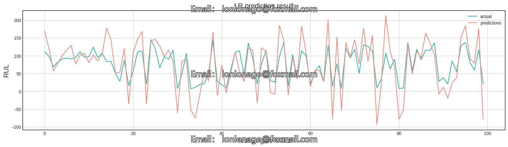
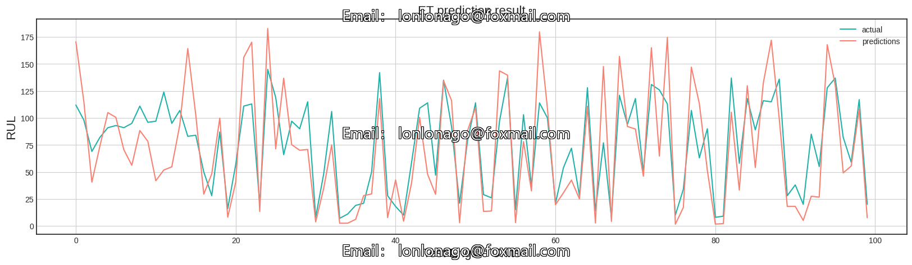
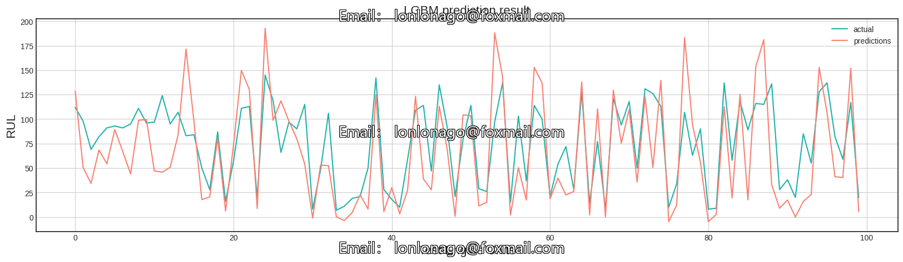
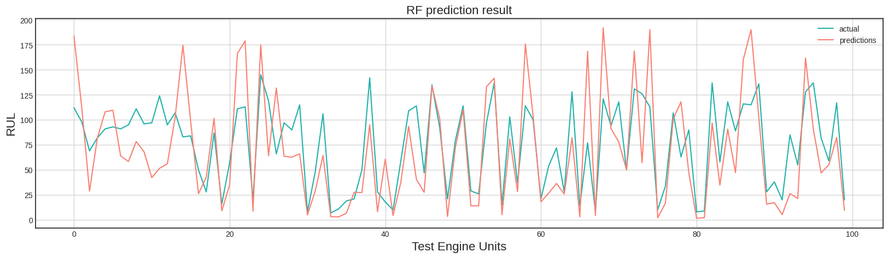
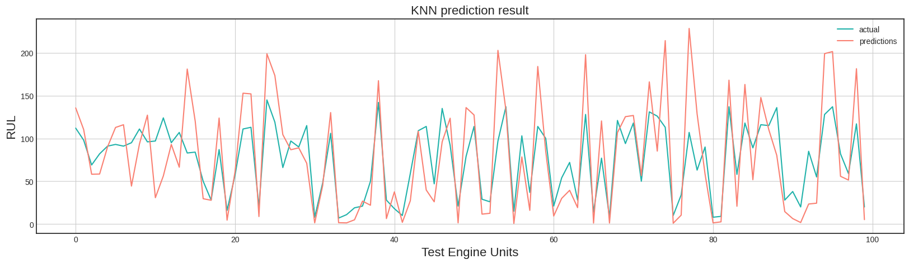
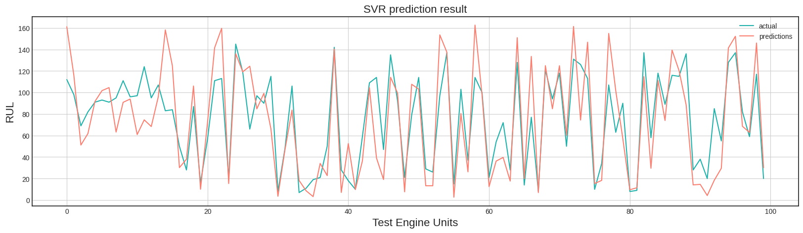
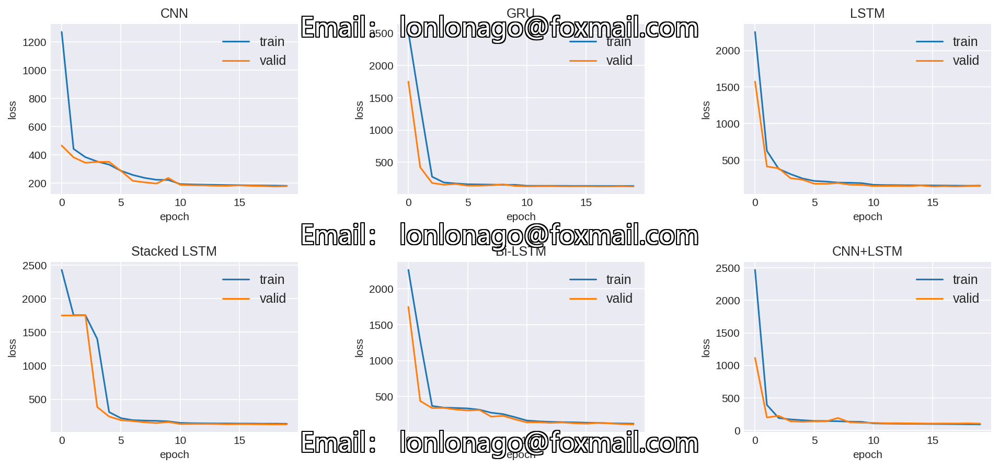
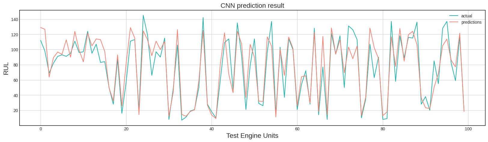
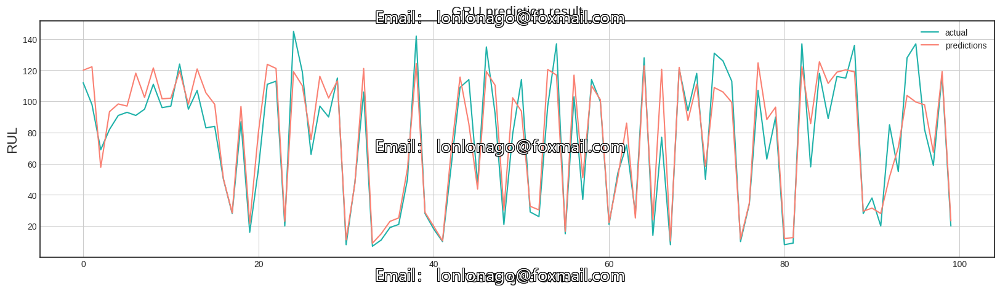
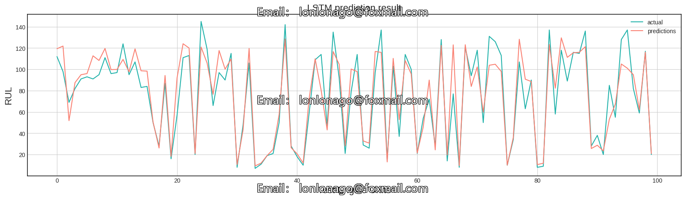
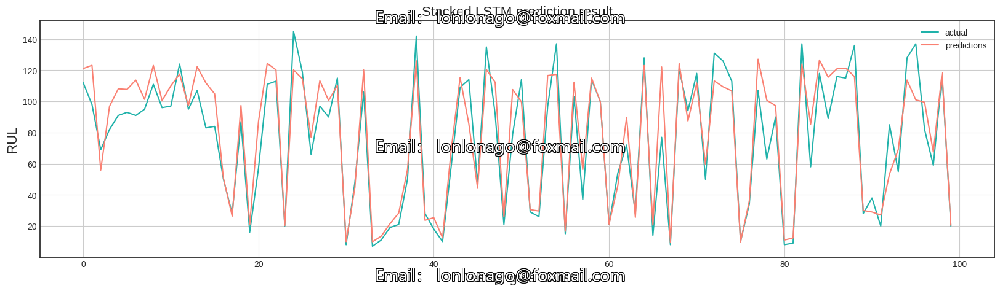
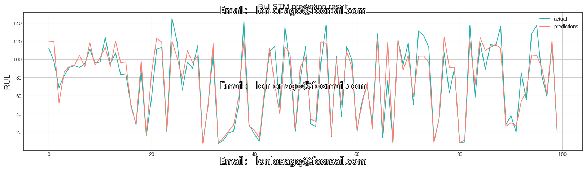
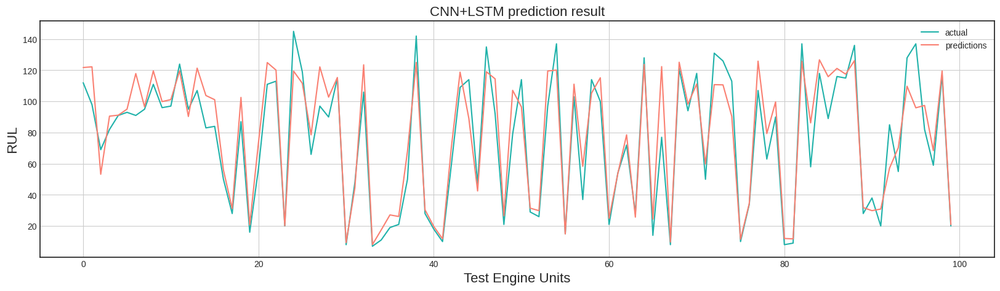

Here is a pay link on Stripe ( https://buy.stripe.com/3cs8yP7sY87d0vu9AB ). Please contact me lonlonago@foxmail.com after funding $89, and I will send you a complete data files , thank you!


